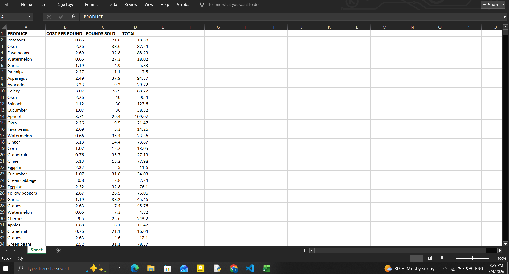
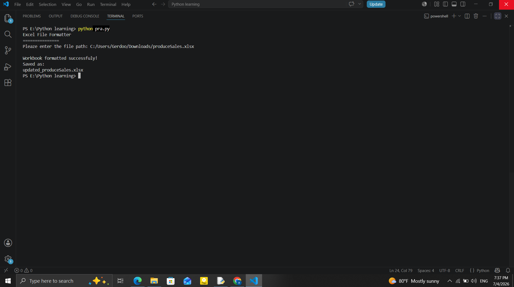
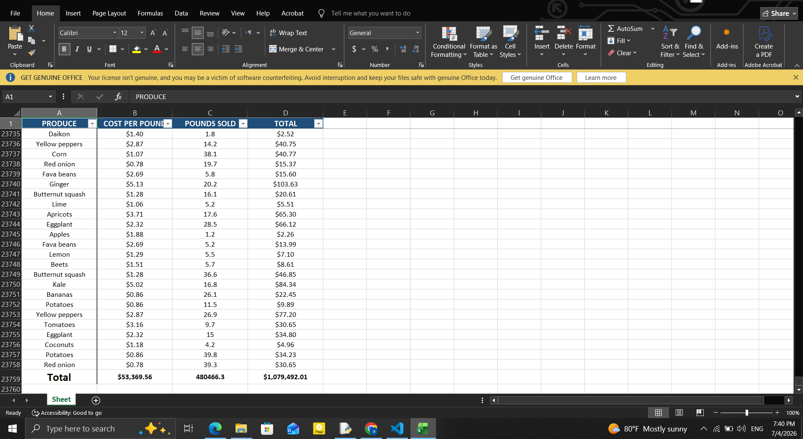

# 📊 Automated Excel File Formatter


A Python CLI automation tool that transforms raw Excel spreadsheets into clean, structured, and presentation-ready reports.

The program works non-destructively: it reads the original workbook, applies formatting and calculations, and saves the result as a new file without modifying the source data.

---

## 🖥️ Pipeline Lifecycle & Live Demo

### Ingestion ➔ Processing ➔ Output

<p align="center">
  
  
</p>

<p align="center">
  
</p>

---

## 🧠 Core Features & Architecture

* 🛡️ **Safe File Handling:** Validates file paths using `pathlib` and ensures the original workbook is never modified. Outputs are saved as a separate file.
* 🧮 **Automated Calculations:** Detects common numeric headers (e.g. revenue, sales, cost, profit) and inserts Excel `SUM` formulas into a summary row.
* 💲 **Currency Formatting:** Applies consistent currency formatting to detected financial columns for improved readability.
* 🎨 **Styling System:** Applies structured formatting including headers, borders, alignment, and color styling to improve spreadsheet clarity.
* 🔍 **Usability Enhancements:** Freezes header row and enables Excel filters for easier navigation of large datasets.

---

## 🛠️ Tech Stack & Requirements

* **Core Language:** Python 3.x  
* **Spreadsheet Engine:** `openpyxl`  
* **File Handling:** `pathlib`  
* **System Utilities:** `sys`  

---

## ⚡ Quick Start & Usage

### 1. Install dependencies
```bash
git clone https://github.com/DevBlueprintLab/python-excel-file-formatter.git
cd python-excel-file-formatter
pip install openpyxl
```
2. Run the tool
```bash
python excel_file_formatter.py
```
3. Execution example
```bash
Excel File Formatter
====================

Please enter the file path:
C:\Users\User\Downloads\sales.xlsx

✓ File loaded successfully
✓ Formatting applied
✓ Output saved as: updated_sales.xlsx
```
## 📁 Project Structure
```
python-excel-file-formatter/
├── excel-file-formatter.py       # Main automation script
├── README.md                     # Project documentation
└── images/
    ├── before.png
    ├── terminal.png
    └── after.png
```
---
## 🔮 Roadmap & Future Improvements
 * Support for multi-sheet processing
 * Automatic detection of date columns
 * Improved auto-sizing for large datasets
 * Optional chart generation for summaries
 * GUI version for non-technical users
---
Developed by DevBlueprint Lab
